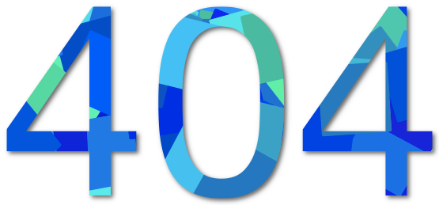

# Kunkka
本Wordpress主题以[牧风](https://mufeng.me/)大神的Kunkka 1.06为基础改进而来，可以在[我的博客](http://agatelee.cn)看到效果

# ToDo

* 回复中的表情符号没有被替换

# 版本说明

**v1.06**

牧风原版

**v1.08_local**

修改版，改动如`2016-06-17 更新日志`和`2016-06-18 更新日志`

**v1.09_local**

自定义表情支持，评论表情选择

**v1.10_local**

更正了logo分辨率、将代码中的tab替换为4个空格

**v1.11_local**

修改了显示bug，改动如`2016-06-19 更新日志`后面部分

# 更新日志

**2016-06-19**

* 自定义表情支持
* 修改了all.js
  * 手机上点击评论表情dropdown无法弹出
  * ipadmini2纵向放置出现了mobile-menu无法触发
  * 桌面浏览器缩小窗口出现了mobile-menu无法出发
* 关于页面IOS移动设备可以触发hover事件
  * 显示微信二维码

**2016-06-18**

* 关于页面功能增加
* 404页面功能增加
* 增加了分类页面

**2016-06-17**

* 本地化
  * 替换了首页logo
  * 替换了默认图片
  * 备案号
* 对于置顶的文章显示全文
* 重新设计了404页面

  
* 增加了表格样式
* 增加了代码样式
* 增加了友情链接页面
* 增加了关于页面
